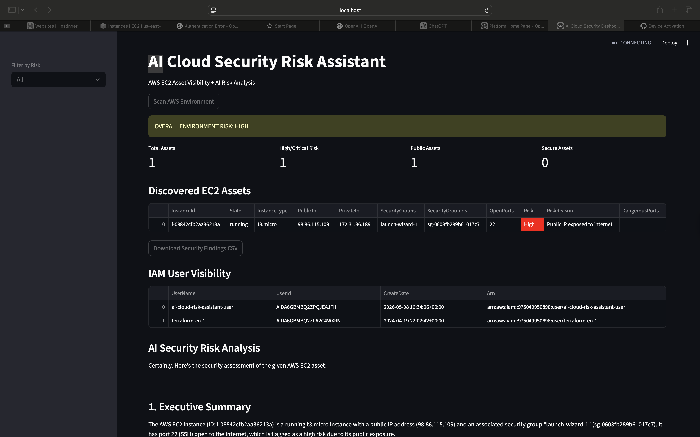
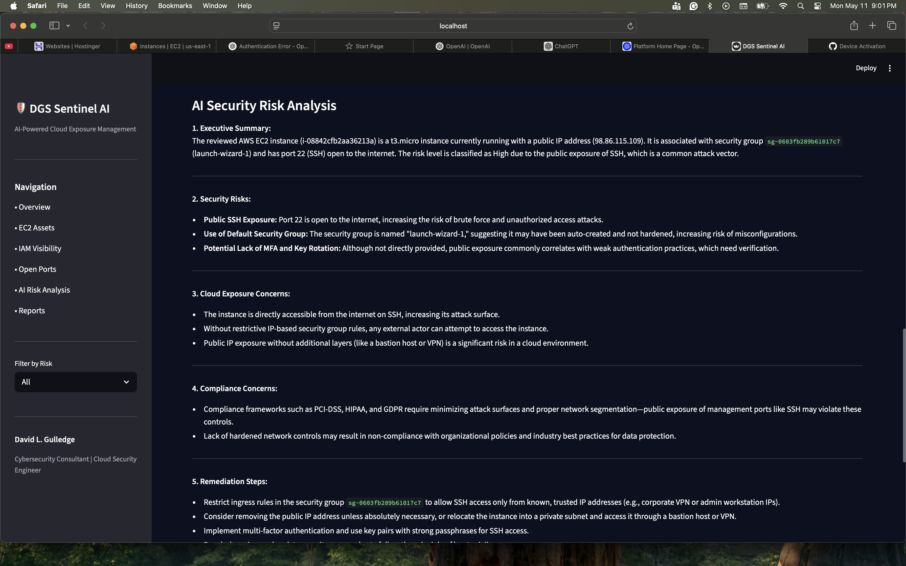

# 🛡️ DGS Sentinel AI

### AI-Powered Cloud Exposure Management Platform

DGS Sentinel AI is an AI-powered cloud exposure management platform designed to provide real-time AWS asset visibility, attack surface analysis, cloud security analytics, and AI-generated remediation guidance aligned with modern CAASM/CSPM concepts.

Built using AWS, Python, Streamlit, Plotly, OpenAI APIs, and Boto3.

---

# 🚀 Project Overview

DGS Sentinel AI automates cloud security visibility and exposure analysis by integrating AWS infrastructure discovery, IAM visibility, risk analytics, and AI-driven security insights into a unified dashboard platform.

The platform is designed to simulate modern:

* CAASM (Cyber Asset Attack Surface Management)
* CSPM (Cloud Security Posture Management)
* Cloud Exposure Management
* Attack Surface Analytics
* AI Security Operations

---

# 🔥 Platform Capabilities

* AWS EC2 Asset Discovery
* IAM Visibility & Identity Analytics
* Security Group Inspection
* Open Port Detection
* Internet Exposure Analysis
* Risk Severity Classification
* AI Security Risk Analysis
* Interactive Plotly Dashboards
* Executive Security Reporting
* CSV Security Findings Export
* Cloud Exposure Analytics
* CAASM/CSPM Concepts

---

# 📊 Dashboard Features

## Executive Security Dashboard

Provides:

* Total cloud asset visibility
* High-risk asset detection
* Public exposure analysis
* Secure asset tracking
* Executive cloud risk metrics

---

## Interactive Risk Analytics

Built using Plotly interactive visualizations:

* Risk severity distribution
* Exposure analytics
* Public vs private asset visibility
* Cloud attack surface insights

---

## AI Security Analysis

OpenAI-powered analysis engine provides:

* Executive summaries
* Cloud exposure insights
* Security recommendations
* Remediation guidance
* Risk prioritization

---

# 🏗️ Platform Architecture

```text
AWS EC2 / IAM
        │
        ▼
     Boto3 SDK
        │
        ▼
Python Risk Engine
        │
        ├── Plotly Analytics
        │
        ├── Streamlit Dashboard
        │
        └── OpenAI Risk Analysis
```

---

# ⚙️ Tech Stack

| Technology | Purpose                              |
| ---------- | ------------------------------------ |
| Python     | Core application logic               |
| AWS EC2    | Cloud infrastructure visibility      |
| AWS IAM    | Identity visibility                  |
| Boto3      | AWS API integration                  |
| Streamlit  | Dashboard framework                  |
| Plotly     | Interactive analytics visualizations |
| OpenAI API | AI-generated risk analysis           |
| Pandas     | Data processing                      |
| GitHub     | Version control & portfolio          |

---

# 📸 Dashboard Preview

## Main Dashboard



---

## Risk Analytics



---

## IAM Visibility


---

# 🧠 Risk Detection Logic

DGS Sentinel AI evaluates:

* Public IP exposure
* Internet-accessible security groups
* Open SSH/RDP ports
* Cloud attack surface visibility
* IAM exposure conditions
* Asset risk severity

### Risk Classification

| Risk Level | Description                            |
| ---------- | -------------------------------------- |
| Critical   | Internet exposure with dangerous ports |
| High       | Public-facing infrastructure           |
| Medium     | Moderate exposure conditions           |
| Low        | Private/internal assets                |

---

# 🔒 Security Use Cases

* Cloud Exposure Management
* CAASM/CSPM Analytics
* AWS Asset Intelligence
* Executive Security Reporting
* Cloud Security Engineering
* Attack Surface Management
* Security Operations Analytics
* Compliance Visibility

---

# 🚀 Future Roadmap

Planned enhancements include:

* S3 exposure scanning
* Multi-account AWS support
* CVE vulnerability enrichment
* Compliance mapping (NIST/FedRAMP)
* AI security chatbot
* Real-time alerting
* Automated remediation workflows
* Graph analytics & attack pathing

---

# ▶️ How To Run

## Clone Repository

```bash
git clone https://github.com/dlgul71/ai-cloud-risk-assistant.git
```

---

## Install Dependencies

```bash
pip install -r requirements.txt
```

---

## Run Application

```bash
streamlit run app.py
```

---

# 👨‍💻 Author

David L. Gulledge
Cybersecurity Consultant | CAASM | Cloud Security Engineer

LinkedIn:
https://www.linkedin.com/in/david-l-gulledge-8b5a328

GitHub:
https://github.com/dlgul71

---

# ⚠️ Disclaimer

This project is intended for educational, research, portfolio, and authorized security assessment purposes only.
