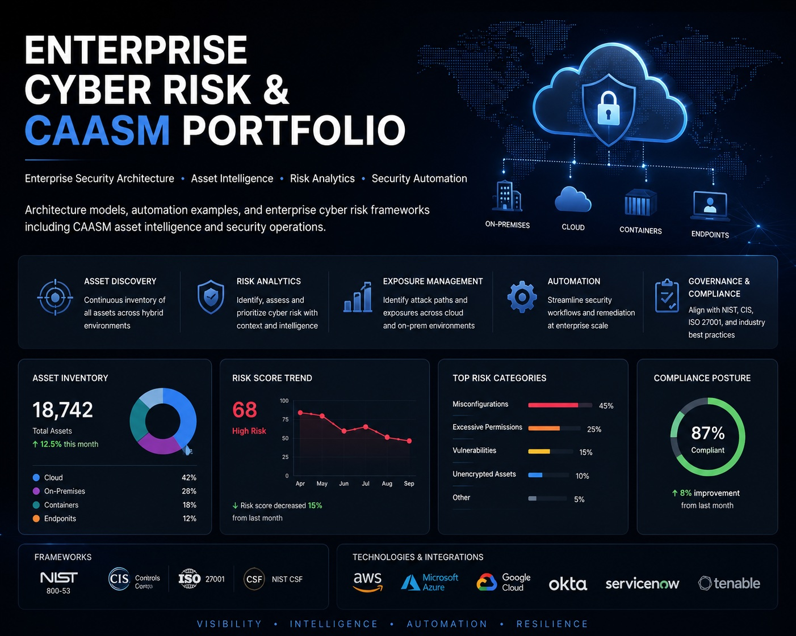
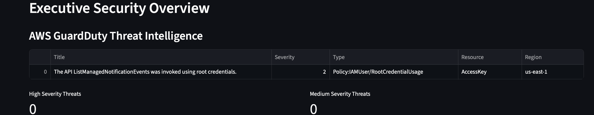
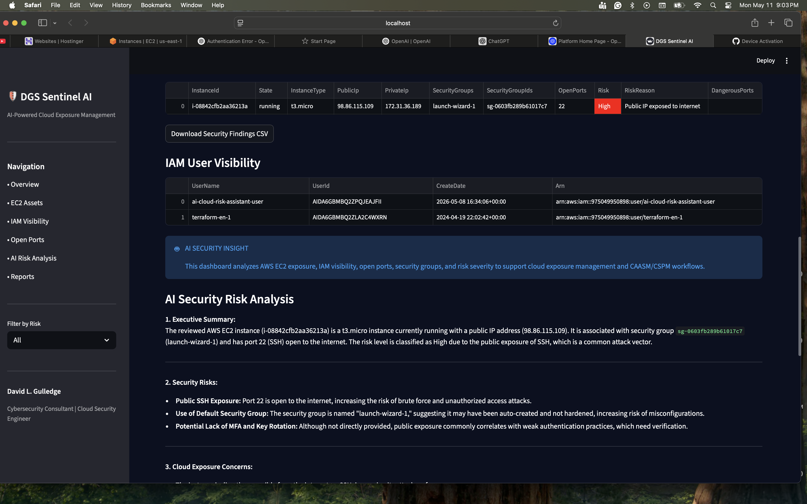
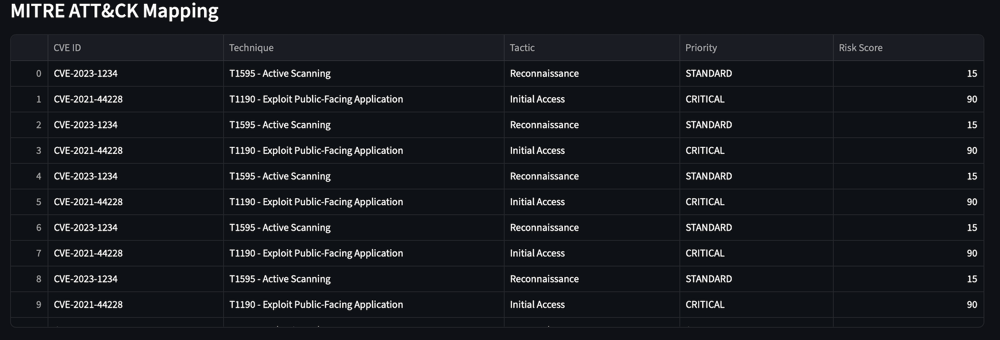

# 🛡️ DGS Sentinel AI



Enterprise AI-Powered Cybersecurity Analytics Platform

DGS Sentinel AI is a next-generation cybersecurity analytics and cloud exposure management platform designed to provide real-time visibility across enterprise cloud environments.


The platform combines:

- Cyber Asset Attack Surface Management (CAASM)
- Cloud Security Posture Management (CSPM)
- Cloud-Native Application Protection Platform (CNAPP)
- AI-powered executive cyber risk analytics
- Threat intelligence correlation
- Automated cloud exposure monitoring

DGS Sentinel AI helps organizations identify security risks, exposed assets, vulnerable identities, and cloud misconfigurations while delivering executive-level remediation guidance and operational threat visibility.

---

# 🚀 Core Platform Capabilities

# 📸 Platform Screenshots

## Executive Security Dashboard


---

## GuardDuty Threat Intelligence



---

## IAM Exposure Analytics



---

## Cloud Security Scorecard


---

## MITRE ATT&CK Mapping



---

## AI Executive Risk Summary


---

## Executive Security Dashboard
- Enterprise cyber risk scoring
- Executive KPI visualization
- Threat severity analytics
- Enterprise exposure monitoring
- Cloud risk posture analytics
- Operational threat intelligence

## Cloud Security Posture Management (CSPM)
- AWS Security Hub integration
- Cloud misconfiguration detection
- Public exposure analysis
- Security posture scoring
- Compliance visibility
- Cloud asset inventory

## Cyber Asset Attack Surface Management (CAASM)
- Enterprise asset visibility
- EC2 asset discovery
- IAM identity analytics
- Stale credential exposure detection
- Asset correlation and normalization
- Cloud identity exposure analysis

## Cloud-Native Application Protection Platform (CNAPP)
- GuardDuty threat intelligence ingestion
- Runtime threat visibility
- Threat severity prioritization
- Identity risk analytics
- Exposure intelligence correlation

## AI Security Copilot
- AI executive remediation guidance
- AI-generated risk narratives
- Executive threat analysis
- Cloud risk recommendations
- Automated security interpretation

## Threat Intelligence & Vulnerability Analytics
- Known Exploited Vulnerability (KEV) mapping
- MITRE ATT&CK mapping
- Threat severity classification
- Exploitation intelligence correlation
- Risk prioritization analytics

## Reporting & Executive Exports
- Executive PDF reporting
- Threat evidence exports
- Remediation reporting
- Operational security dashboards
- Security analytics reporting

---

# ☁️ AWS Services Integrated

DGS Sentinel AI currently integrates with:

- AWS Security Hub
- AWS GuardDuty
- AWS IAM
- AWS EC2
- AWS S3
- AWS Organizations
- AWS STS

---

# 🧠 AI & Analytics Features

The platform leverages AI-assisted cybersecurity analytics to:

- Generate executive security summaries
- Prioritize remediation actions
- Correlate threat intelligence
- Analyze cloud exposure risk
- Produce operational risk narratives
- Enhance security operations visibility

---

# 📊 Security Analytics

## Identity & Access Analytics
- MFA visibility
- Privileged account exposure
- Stale credential analysis
- Identity risk analytics

## Threat Detection
- GuardDuty threat ingestion
- Threat severity analysis
- Cloud runtime threat visibility
- Security Hub findings aggregation

## Vulnerability Intelligence
- KEV intelligence enrichment
- Exploited vulnerability prioritization
- Ransomware exposure visibility
- CVE risk scoring

## Attack Surface Visibility
- Cloud asset inventory
- Public exposure analysis
- S3 exposure analytics
- Cloud risk correlation

---

# 🏗️ Platform Architecture

DGS Sentinel AI follows a modular cybersecurity analytics architecture:

1. Cloud Telemetry Ingestion
2. Threat Intelligence Correlation
3. Asset Normalization
4. Exposure Analytics
5. AI Risk Interpretation
6. Executive Reporting
7. Continuous Security Monitoring

---

# 🛠️ Technology Stack

## Backend & Analytics
- Python
- Pandas
- Requests

## Cloud & Security
- AWS Boto3
- AWS Security Hub
- AWS GuardDuty
- AWS IAM

## AI & Automation
- OpenAI API
- AI Executive Risk Analytics
- Automated Threat Correlation

## Visualization & Reporting
- Streamlit
- Plotly
- ReportLab

---

# ⚙️ Installation

```bash
git clone https://github.com/dlgul71/ai-cloud-risk-assistant.git

cd ai-cloud-risk-assistant

python3 -m venv venv

source venv/bin/activate

pip install -r requirements.txt

streamlit run app.py
```

---

# 🔑 Environment Configuration

## OpenAI API Key

```bash
export OPENAI_API_KEY="your_api_key_here"
```

## AWS Configuration

```bash
export AWS_PROFILE=default
export AWS_REGION=us-east-1
```

---

# 📈 Current Platform Features

✅ AWS Security Hub ingestion  
✅ AWS GuardDuty integration  
✅ IAM exposure analytics  
✅ EC2 asset inventory  
✅ S3 exposure analytics  
✅ KEV intelligence correlation  
✅ MITRE ATT&CK mapping  
✅ Executive PDF reporting  
✅ AI remediation guidance  
✅ Risk trend analytics  
✅ Enterprise security scorecard  
✅ Multi-account AWS visibility  

---

# 🔮 Future Enhancements

- Multi-cloud support (Azure/GCP)
- Docker deployment
- Kubernetes security monitoring
- Vulnerability scanner integrations
- Real-time alerting engine
- CI/CD security analytics
- RBAC authentication
- Multi-tenant SaaS architecture
- Security Lake ingestion
- Axonius-style asset correlation
- Real-time threat intelligence feeds

---

# 👨‍💻 Author

David L. Gulledge

Cybersecurity | CAASM | Cloud Security | AI Security Analytics | Enterprise Risk Management

GitHub:
https://github.com/dlgul71

LinkedIn:
https://www.linkedin.com/in/david-l-gulledge-8b5a328/

---

# ⚠️ Disclaimer

DGS Sentinel AI is intended for cybersecurity research, cloud security analytics, enterprise visibility, and authorized security operations activities only.

Users are responsible for ensuring compliance with organizational security policies and applicable laws.# 🛡️ DGS Sentinel AI

Enterprise AI-Powered Cybersecurity Analytics Platform

DGS Sentinel AI is a next-generation cybersecurity analytics and cloud exposure management platform designed to provide real-time visibility across enterprise cloud environments.

The platform combines:

- Cyber Asset Attack Surface Management (CAASM)
- Cloud Security Posture Management (CSPM)
- Cloud-Native Application Protection Platform (CNAPP)
- AI-powered executive cyber risk analytics
- Threat intelligence correlation
- Automated cloud exposure monitoring

DGS Sentinel AI helps organizations identify security risks, exposed assets, vulnerable identities, and cloud misconfigurations while delivering executive-level remediation guidance and operational threat visibility.

---

# 🚀 Core Platform Capabilities

## Executive Security Dashboard
- Enterprise cyber risk scoring
- Executive KPI visualization
- Threat severity analytics
- Enterprise exposure monitoring
- Cloud risk posture analytics
- Operational threat intelligence

## Cloud Security Posture Management (CSPM)
- AWS Security Hub integration
- Cloud misconfiguration detection
- Public exposure analysis
- Security posture scoring
- Compliance visibility
- Cloud asset inventory

## Cyber Asset Attack Surface Management (CAASM)
- Enterprise asset visibility
- EC2 asset discovery
- IAM identity analytics
- Stale credential exposure detection
- Asset correlation and normalization
- Cloud identity exposure analysis

## Cloud-Native Application Protection Platform (CNAPP)
- GuardDuty threat intelligence ingestion
- Runtime threat visibility
- Threat severity prioritization
- Identity risk analytics
- Exposure intelligence correlation

## AI Security Copilot
- AI executive remediation guidance
- AI-generated risk narratives
- Executive threat analysis
- Cloud risk recommendations
- Automated security interpretation

## Threat Intelligence & Vulnerability Analytics
- Known Exploited Vulnerability (KEV) mapping
- MITRE ATT&CK mapping
- Threat severity classification
- Exploitation intelligence correlation
- Risk prioritization analytics

## Reporting & Executive Exports
- Executive PDF reporting
- Threat evidence exports
- Remediation reporting
- Operational security dashboards
- Security analytics reporting

---

# ☁️ AWS Services Integrated

DGS Sentinel AI currently integrates with:

- AWS Security Hub
- AWS GuardDuty
- AWS IAM
- AWS EC2
- AWS S3
- AWS Organizations
- AWS STS

---

# 🧠 AI & Analytics Features

The platform leverages AI-assisted cybersecurity analytics to:

- Generate executive security summaries
- Prioritize remediation actions
- Correlate threat intelligence
- Analyze cloud exposure risk
- Produce operational risk narratives
- Enhance security operations visibility

---

# 📊 Security Analytics

## Identity & Access Analytics
- MFA visibility
- Privileged account exposure
- Stale credential analysis
- Identity risk analytics

## Threat Detection
- GuardDuty threat ingestion
- Threat severity analysis
- Cloud runtime threat visibility
- Security Hub findings aggregation

## Vulnerability Intelligence
- KEV intelligence enrichment
- Exploited vulnerability prioritization
- Ransomware exposure visibility
- CVE risk scoring

## Attack Surface Visibility
- Cloud asset inventory
- Public exposure analysis
- S3 exposure analytics
- Cloud risk correlation

---

# 🏗️ Platform Architecture

DGS Sentinel AI follows a modular cybersecurity analytics architecture:

1. Cloud Telemetry Ingestion
2. Threat Intelligence Correlation
3. Asset Normalization
4. Exposure Analytics
5. AI Risk Interpretation
6. Executive Reporting
7. Continuous Security Monitoring

---

# 🛠️ Technology Stack

## Backend & Analytics
- Python
- Pandas
- Requests

## Cloud & Security
- AWS Boto3
- AWS Security Hub
- AWS GuardDuty
- AWS IAM

## AI & Automation
- OpenAI API
- AI Executive Risk Analytics
- Automated Threat Correlation

## Visualization & Reporting
- Streamlit
- Plotly
- ReportLab

---

# ⚙️ Installation

```bash
git clone https://github.com/dlgul71/ai-cloud-risk-assistant.git

cd ai-cloud-risk-assistant

python3 -m venv venv

source venv/bin/activate

pip install -r requirements.txt

streamlit run app.py
```

---

# 🔑 Environment Configuration

## OpenAI API Key

```bash
export OPENAI_API_KEY="your_api_key_here"
```

## AWS Configuration

```bash
export AWS_PROFILE=default
export AWS_REGION=us-east-1
```

---

# 📈 Current Platform Features

✅ AWS Security Hub ingestion  
✅ AWS GuardDuty integration  
✅ IAM exposure analytics  
✅ EC2 asset inventory  
✅ S3 exposure analytics  
✅ KEV intelligence correlation  
✅ MITRE ATT&CK mapping  
✅ Executive PDF reporting  
✅ AI remediation guidance  
✅ Risk trend analytics  
✅ Enterprise security scorecard  
✅ Multi-account AWS visibility  

---

# 🔮 Future Enhancements

- Multi-cloud support (Azure/GCP)
- Docker deployment
- Kubernetes security monitoring
- Vulnerability scanner integrations
- Real-time alerting engine
- CI/CD security analytics
- RBAC authentication
- Multi-tenant SaaS architecture
- Security Lake ingestion
- Axonius-style asset correlation
- Real-time threat intelligence feeds

---

# 👨‍💻 Author

David L. Gulledge

Cybersecurity | CAASM | Cloud Security | AI Security Analytics | Enterprise Risk Management

GitHub:
https://github.com/dlgul71

LinkedIn:
https://www.linkedin.com/in/david-l-gulledge-8b5a328/

---

# ⚠️ Disclaimer

DGS Sentinel AI is intended for cybersecurity research, cloud security analytics, enterprise visibility, and authorized security operations activities only.

Users are responsible for ensuring compliance with organizational security policies and applicable laws.# 🛡️ DGS Sentinel AI

### AI-Powered Cloud Exposure Management Platform


DGS Sentinel AI is an AI-powered cloud exposure management platform designed to provide real-time AWS asset visibility, attack surface analysis, cloud security analytics, and AI-generated remediation guidance aligned with modern CAASM/CSPM concepts.

Built using AWS, Python, Streamlit, Plotly, OpenAI APIs, and Boto3.

---

# 🚀 Project Overview

DGS Sentinel AI automates cloud security visibility and exposure analysis by integrating AWS infrastructure discovery, IAM visibility, risk analytics, and AI-driven security insights into a unified dashboard platform.

The platform is designed to simulate modern:

* CAASM (Cyber Asset Attack Surface Management)
* CSPM (Cloud Security Posture Management)
* Cloud Exposure Management
* Attack Surface Analytics
* AI Security Operations

---

# 🔥 Why This Project Matters

Modern cloud environments often suffer from visibility gaps across assets, identities, internet exposure conditions, and security configurations.

DGS Sentinel AI demonstrates how AI-driven cloud exposure management platforms can improve visibility, automate risk analysis, and support modern cloud security operations aligned with CAASM and CSPM methodologies.

---

# 🧠 Platform Capabilities

* AWS EC2 Asset Discovery
* IAM Visibility & Identity Analytics
* Security Group Inspection
* Open Port Detection
* Internet Exposure Analysis
* Risk Severity Classification
* AI Security Risk Analysis
* Interactive Plotly Dashboards
* Executive Security Reporting
* CSV Security Findings Export
* Cloud Exposure Analytics
* CAASM/CSPM Concepts

---

# 📊 Dashboard Features

## Executive Security Dashboard

Provides:

* Total cloud asset visibility
* High-risk asset detection
* Public exposure analysis
* Secure asset tracking
* Executive cloud risk metrics

---

## Interactive Risk Analytics

Built using Plotly interactive visualizations:

* Risk severity distribution
* Exposure analytics
* Public vs private asset visibility
* Cloud attack surface insights

---

## AI Security Analysis

OpenAI-powered analysis engine provides:

* Executive summaries
* Cloud exposure insights
* Security recommendations
* Remediation guidance
* Risk prioritization

---

# 🏗️ Platform Architecture

```text
AWS EC2 / IAM
        │
        ▼
     Boto3 SDK
        │
        ▼
Python Risk Engine
        │
        ├── Plotly Analytics
        │
        ├── Streamlit Dashboard
        │
        └── OpenAI Risk Analysis


# 🔐 Authentication & Security

DGS Sentinel AI includes built-in authentication and role-based access
control to protect cloud security telemetry and sensitive remediation
operations.

Current security capabilities include:

- Username and password authentication
- Protected dashboard access
- Session management and automatic timeout
- Logout functionality
- Secure credential storage through environment variables or Streamlit secrets
- Role-aware navigation
- Action-level remediation authorization
- Safe fallback to the Viewer role for unknown role values

## Application Authentication Configuration

~~~bash
export APP_USERNAME="administrator"
export APP_PASSWORD="replace-with-a-secure-password"  # pragma: allowlist secret
export DGS_APP_ROLE="Administrator"
~~~

Supported application roles are:

- `Administrator` — full dashboard, client-management, approval, execution,
  evidence, and system-health access
- `Analyst` — dashboard, scan, and execution-evidence access
- `Viewer` — read-only dashboard access

Role names are normalized without regard to capitalization. Missing or invalid
role values default safely to `Viewer`.

---

# 📡 Splunk SIEM Integration

DGS Sentinel AI can export filtered remediation audit events to Splunk through
the HTTP Event Collector (HEC).

## Splunk HEC Configuration

~~~bash
export SPLUNK_HEC_URL="https://splunk.example.com:8088"
export SPLUNK_HEC_TOKEN="replace-with-a-secure-hec-token"
export SPLUNK_INDEX="dgs_security"
export SPLUNK_SOURCE="dgs_sentinel_ai"
export SPLUNK_SOURCETYPE="dgs:security:event"
export SPLUNK_VERIFY_SSL="true"
export SPLUNK_TIMEOUT_SECONDS="10"
~~~

The application automatically normalizes the HEC URL to:

~~~text
/services/collector/event
~~~

The HEC token is excluded from application configuration summaries and must
never be committed to Git, logs, screenshots, or documentation.

## Audit Event Export

From the **Execution Center**:

1. Open the **Execution Audit Trail**.
2. Optionally filter records by remediation action ID.
3. Select **Send Filtered Audit Events to Splunk**.
4. Review the event-level delivery results.

Each exported event includes:

- Audit ID and action ID
- Event timestamp and event type
- Event detail and actor
- Product and schema metadata
- Splunk index, source, and sourcetype metadata

Only users with remediation-execution permission can initiate the export.

---

# 🔎 Axonius CAASM Integration

DGS Sentinel AI supports secure mock and live Axonius connector modes for
collecting asset and identity records.

## Axonius Configuration

~~~bash
export AXONIUS_BASE_URL="https://your-tenant.example.com"
export AXONIUS_API_KEY="replace-with-an-api-key"  # pragma: allowlist secret
export AXONIUS_API_SECRET="replace-with-an-api-secret"  # pragma: allowlist secret
export AXONIUS_ASSETS_PATH="/api/assets"
export AXONIUS_IDENTITIES_PATH="/api/identities"
export AXONIUS_VERIFY_SSL="true"
export AXONIUS_TIMEOUT_SECONDS="30"
~~~

Set the asset and identity paths to the authorized routes supported by the
Axonius tenant and API version.

The connector:

- Requires an HTTPS base URL
- Rejects embedded URL credentials
- Rejects absolute endpoint URLs
- Keeps the API key and secret out of configuration summaries
- Defaults to SSL certificate verification
- Uses mock data when live credentials are unavailable
- Provides an optional read-only connectivity check under **System Health**

## Correlated Exposure Analytics

DGS Sentinel AI v1.6 correlates Axonius asset, identity, and connector-coverage
records to identify combined exposure conditions that may not be visible when
the datasets are reviewed separately.

Correlation capabilities include:

- Asset-owner and identity matching
- Privileged-access and MFA analysis
- Orphaned-identity detection
- Unmanaged-asset detection
- Connector availability and coverage analysis
- Per-asset correlated exposure scoring
- Critical, high, moderate, and standard prioritization
- Correlation dashboard metrics and charts
- Correlated exposure CSV export
- Snapshot persistence, trend analysis, and delta reporting
- Correlation-aware executive recommendations

See `docs/AXONIUS_CORRELATION_VALIDATION.md` for the v1.6 validation record.

## Correlated Exposure Alerting

DGS Sentinel AI v1.7 converts critical and high correlated-exposure results
into persistent operational alerts.

Alerting capabilities include:

- Stable alert fingerprints
- Asset-and-source alert deduplication
- Recurring-alert occurrence tracking
- Open, acknowledged, and resolved lifecycle states
- Configurable notification cooldowns
- Successful-delivery tracking
- Automatic reopening of recurring resolved exposures
- Optional Splunk HEC delivery
- Partial-delivery failure reporting
- RBAC-controlled alert processing and lifecycle actions
- Dashboard alert metrics, acknowledgment, and resolution controls

Alert processing requires scan permission. Alert acknowledgment and resolution
require remediation-execution permission.

Splunk delivery requires `SPLUNK_HEC_URL` and `SPLUNK_HEC_TOKEN`.

See `docs/AXONIUS_ALERTING_VALIDATION.md` for the v1.7 validation record.

Do not commit Axonius or Splunk credentials to Git, logs, screenshots, or
documentation.

See `docs/AXONIUS_CONNECTOR_VALIDATION.md` for the v1.5 validation record.

## Microsoft Defender for Cloud Intelligence

DGS Sentinel AI v1.8 expands the existing Azure security-posture integration
into a resilient, read-only Microsoft Defender for Cloud intelligence layer.

Defender capabilities include:

- Secure-score discovery and percentage normalization
- Secure-score control analysis
- Healthy, unhealthy, and not-applicable resource counts
- Assessment metadata enrichment
- Recommendation severity and operational prioritization
- Actual affected Azure resource-ID extraction
- Remediation guidance, categories, threats, tactics, and techniques
- Defender security-alert discovery
- Alert severity, status, compromised entity, and MITRE technique context
- Defender pricing and protection-plan visibility
- Complete, partial, and failed component-discovery status
- Partial-failure preservation of available results
- Dashboard metrics and dedicated Defender analysis tabs

The v1.8 integration is read-only. It does not modify Defender plans, update
alert states, create assessments, or execute remediation actions.

Validation used controlled Azure SDK objects and automated tests. Production
tenant validation requires authorized Microsoft Entra credentials and
appropriate Defender for Cloud read permissions.

See `docs/AZURE_DEFENDER_CLOUD_VALIDATION.md` for the v1.8 validation record.

Do not commit Azure tenant IDs, client secrets, access tokens, alert evidence,
or other sensitive cloud information to Git, logs, screenshots, or
documentation.

---

# 📄 Executive Reporting

DGS Sentinel AI generates executive-level cyber risk assessment reports designed for leadership, compliance teams, and security stakeholders.

Report capabilities include:

- Executive risk summaries
- Security posture metrics
- AI-generated risk narratives
- Threat intelligence analysis
- Remediation prioritization
- MITRE ATT&CK mapping
- PDF export for client deliverables

Reports help organizations communicate cyber risk in business-focused language while providing actionable remediation guidance.

---

# 🐳 Docker Deployment

Build the container:

```bash
docker build -t dgs-sentinel-ai .
```

Run locally:

```bash
docker run -p 8501:8501 dgs-sentinel-ai
```

Run with AWS credentials and Streamlit secrets mounted:

```bash
docker run -p 8501:8501 \
  -v ~/.aws:/root/.aws:ro \
  -v $(pwd)/.streamlit:/app/.streamlit:ro \
  dgs-sentinel-ai
```

Access the application:

```text
http://localhost:8501
```

---

# 🚀 Phase 1 Milestones Completed

✅ Authentication System

✅ Secure Dashboard Access

✅ Session Timeout Controls

✅ Executive PDF Reporting

✅ Docker Containerization

✅ Cloud Threat Intelligence Integration

✅ IAM Exposure Analytics

✅ MITRE ATT&CK Mapping

✅ AI Executive Risk Analysis

DGS Sentinel AI is now deployable as a secure cloud security visibility and cyber risk assessment platform.

---

# 🔐 Remediation Evidence Key Rotation Operations

DGS Sentinel AI signs remediation evidence with HMAC-SHA256.

## Required Environment Variables

~~~bash
export DGS_REMEDIATION_EVIDENCE_HMAC_KEY="current-signing-key"
~~~

During a key rotation, retain prior keys temporarily:

~~~bash
export DGS_REMEDIATION_EVIDENCE_PREVIOUS_HMAC_KEYS="previous-key-one,previous-key-two"
~~~

New evidence is signed only with the current key. Previous keys are used only to verify historical evidence.

## Rotation Procedure

1. Record the current evidence key ID.
2. Generate and securely store a new HMAC key.
3. Move the current key into `DGS_REMEDIATION_EVIDENCE_PREVIOUS_HMAC_KEYS`.
4. Configure the new key as `DGS_REMEDIATION_EVIDENCE_HMAC_KEY`.
5. Restart the application.
6. Run the key-rotation validator:

~~~bash
python -m scripts.check_remediation_evidence_keys
~~~

7. Confirm all signed records report `VERIFIED`.
8. Keep prior keys available for the required evidence-retention period.
9. Remove an old key only after no retained evidence depends on its key ID.

The validator returns exit code `0` when all signed evidence verifies, `1` when verification fails, and `2` when required key configuration is missing.

Never commit HMAC keys to Git, application source code, logs, screenshots, or documentation.
