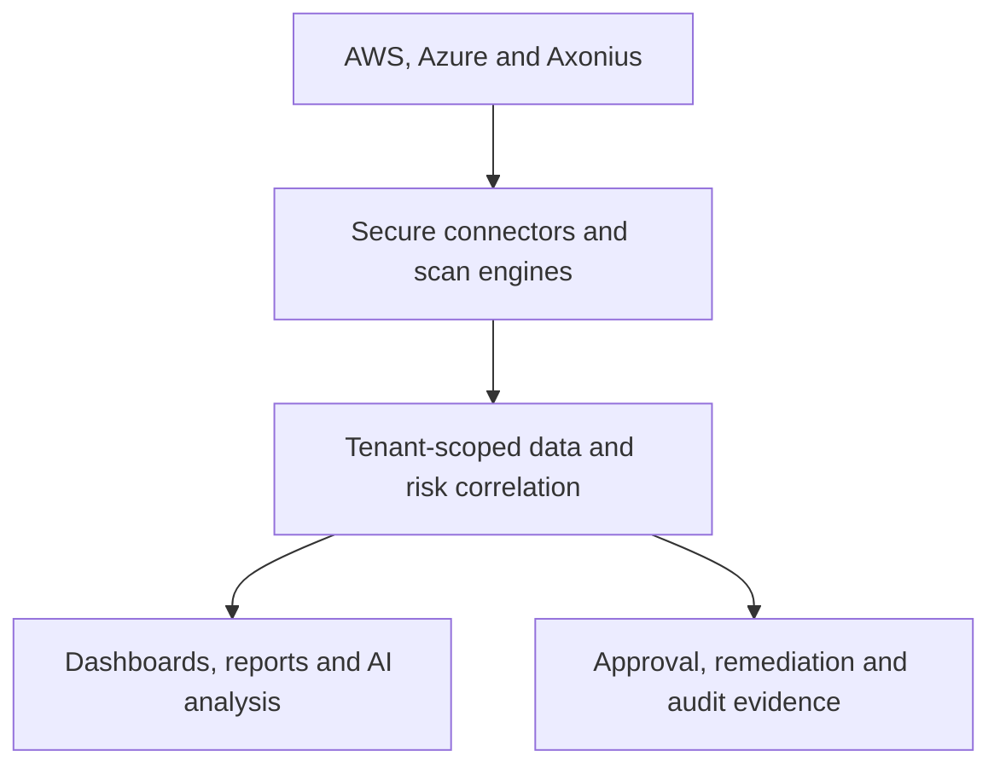
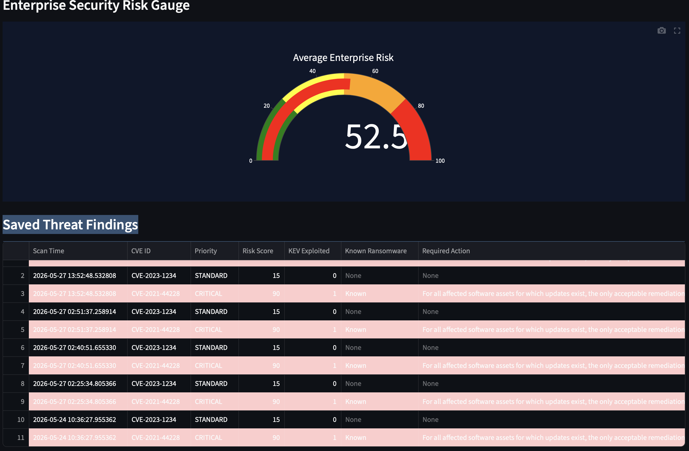

# DGS Sentinel AI


A multi-tenant cloud-security analytics platform developed by Data Generated Solutions, LLC.

DGS Sentinel AI combines cloud asset discovery, identity exposure analysis, threat intelligence, tenant-scoped risk analytics, AI-assisted reporting, and guarded remediation workflows.

> **Current status:** Phase 1 stabilization. The platform has a production-oriented engineering foundation, but it is not represented as deployed at production scale across multiple paying customers.

## Platform Overview

DGS Sentinel AI provides a unified security-analysis layer across AWS, Azure, Axonius, Splunk, vulnerability intelligence, and application-generated evidence.

The platform demonstrates capabilities aligned with:

- Cyber Asset Attack Surface Management (CAASM)
- Cloud Security Posture Management (CSPM)
- Cloud-native security analytics
- Identity exposure management
- Security operations reporting
- AI-assisted cyber-risk analysis
- Guarded remediation and evidence management

AI output is advisory. It cannot authorize or execute remediation.

## Capability Status

| Capability | Status |
| --- | --- |
| Multi-tenant data isolation | Implemented |
| Persistent authentication | Implemented foundation |
| Tenant authorization and user administration | Implemented |
| Executive, SOC, and asset dashboards | Implemented |
| AWS asset and finding discovery | Implemented |
| AWS cross-account AssumeRole scanning | Implemented |
| Azure resource and security discovery | Implemented |
| Microsoft Defender for Cloud intelligence | Implemented, read-only |
| Axonius asset and identity correlation | Implemented |
| CAASM exposure alerting | Implemented foundation |
| Splunk HEC audit-event delivery | Implemented |
| AI-assisted security narratives | Implemented, advisory |
| Guarded cloud remediation | Implemented for allowlisted actions |
| Scheduled cloud scanning | Planned |
| Complete backup coverage | Partial |
| Formal database migrations | Planned |
| Repeatable staging infrastructure | Planned |

See [V2_ROADMAP.md](V2_ROADMAP.md) for current priorities and status definitions.

## Architecture



The application currently uses Python, Streamlit, Boto3, Azure SDKs, Plotly, OpenAI APIs, ReportLab, and multiple tenant-aware SQLite persistence domains.

See [Current-State Architecture](docs/architecture/CURRENT_STATE.md) for the verified component and data-flow model.

## Core Capabilities

### Cloud Asset and Exposure Discovery

- AWS EC2 discovery
- IAM identity and MFA analytics
- Security-group and open-port inspection
- Amazon S3 exposure analysis
- Security Hub finding ingestion
- GuardDuty threat intelligence
- Multi-account AWS AssumeRole boundaries
- Azure compute, storage, resource, and subscription discovery
- Microsoft Defender for Cloud intelligence

### CAASM and Identity Analytics

- Axonius asset and identity ingestion
- Asset-owner and identity correlation
- Privileged-access analysis
- MFA exposure detection
- Orphaned-identity detection
- Unmanaged-asset identification
- Connector coverage analysis
- Persistent CAASM exposure alerts
- Alert acknowledgment and resolution workflows

### Threat and Vulnerability Intelligence

- Known Exploited Vulnerabilities correlation
- EPSS enrichment
- NVD vulnerability intelligence
- MITRE ATT&CK mapping
- Severity classification
- Exposure prioritization
- Correlated risk scoring

### Dashboards and Reporting

- Tenant-scoped executive dashboard
- Tenant-scoped SOC dashboard
- Tenant-scoped asset dashboard
- Security scorecards
- Risk-trend analysis
- CSV exports
- Executive PDF reporting
- Remediation and execution evidence
- AI-generated risk narratives

### Guarded Remediation

Live remediation is disabled by default.

The remediation framework includes:

- Role and permission checks
- Separation of approval and execution
- Allowlisted actions
- Dry-run capability
- Preconditions
- Idempotency controls
- Post-remediation verification
- Audit records
- Structured execution evidence
- Tamper-evident evidence integrity
- HMAC evidence authentication
- Evidence-key rotation support

New live actions require targeted testing and documented safety review.

## Screenshots

### Executive Security Dashboard


### GuardDuty Threat Intelligence


### IAM Exposure Analytics


### Cloud Security Scorecard



### MITRE ATT&CK Mapping


### AI Executive Risk Summary


## Security Model

DGS Sentinel AI implements:

- Persistent application users
- Password hashing
- Secure session management
- Session expiration
- Failed-login tracking
- Account lockout
- Authentication audit events
- Role normalization
- Tenant-scoped client access
- Global-administrator restrictions
- Action-level permission enforcement

Supported roles are:

| Role | General access |
| --- | --- |
| Administrator | Administration, dashboards, scanning, approvals, execution, evidence, and health |
| Analyst | Authorized dashboards, scanning, and execution-evidence access |
| Viewer | Read-only authorized dashboard access |

Legacy environment-based authentication fallback is disabled by default and should not be used as the preferred authentication path.

## Local Installation

### Requirements

- Python 3.11 or Python 3.13
- Git
- Authorized cloud credentials for live integrations
- Docker, if using the container workflow

### Setup

```bash
git clone https://github.com/dlgul71/ai-cloud-risk-assistant.git
cd ai-cloud-risk-assistant

python3 -m venv .venv
source .venv/bin/activate

python -m pip install --upgrade pip
python -m pip install -r requirements.txt

cp .env.example .env
```

Never commit the populated `.env` file, cloud credentials, API keys, tokens, client secrets, or security evidence.

### Create the First Persistent Administrator

Generate a password hash without exposing the plaintext password in shell history:

```bash
python - <<'PYHASH'
from getpass import getpass
from authentication import hash_password

password = getpass("Administrator password: ")
confirmation = getpass("Confirm administrator password: ")

if not password or password != confirmation:
    raise SystemExit("Passwords are empty or do not match.")

print("APP_PASSWORD_HASH=" + hash_password(password))
PYHASH
```

Add the generated `APP_PASSWORD_HASH` value and the desired `APP_USERNAME` to the local environment or `.env` file.

Then create the administrator:

```bash
python -m scripts.bootstrap_admin_user
```

The bootstrap command will not overwrite an existing user and does not accept a plaintext password for persistent-user creation.

### Start the Application

```bash
streamlit run app.py
```

Open:

```text
http://localhost:8501
```

## Configuration

Configuration examples are available in [.env.example](.env.example).

Important safety defaults include:

```text
DGS_ALLOW_LEGACY_AUTH_FALLBACK=false
DGS_PUBLIC_DEMO_MODE=false
DGS_LIVE_REMEDIATION_ENABLED=false
```

Do not enable live remediation without validating permissions, preconditions, evidence authentication, rollback expectations, and the target account or subscription.

### AWS

DGS Sentinel AI supports the standard AWS credential chain and explicitly configured cross-account AssumeRole access.

Common local settings include:

```text
AWS_REGION=us-east-1
AWS_PROFILE=default
```

Use least-privilege roles. Cross-account actions must preserve explicit STS AssumeRole boundaries.

### Azure

Azure integration uses Microsoft Entra service-principal credentials:

```text
AZURE_TENANT_ID=
AZURE_CLIENT_ID=
AZURE_CLIENT_SECRET=
AZURE_SUBSCRIPTION_ID=
```

Use only the permissions required for the intended read-only discovery or explicitly approved remediation workflow.

### OpenAI

AI-assisted analysis is optional:

```text
OPENAI_API_KEY=
OPENAI_MODEL=gpt-5.5
```

AI context is tenant-scoped and should contain only the information required for the analysis.

### Axonius

Axonius configuration includes:

```text
AXONIUS_BASE_URL=
AXONIUS_API_KEY=
AXONIUS_API_SECRET=
```

The connector requires HTTPS, rejects embedded URL credentials, uses bounded timeouts, and keeps secrets out of configuration summaries.

See:

- [Axonius Connector Validation](docs/AXONIUS_CONNECTOR_VALIDATION.md)
- [Axonius Correlation Validation](docs/AXONIUS_CORRELATION_VALIDATION.md)
- [Axonius Alerting Validation](docs/AXONIUS_ALERTING_VALIDATION.md)

### Splunk

Filtered remediation audit events and CAASM alerts can be delivered to Splunk through the HTTP Event Collector.

See [Splunk HEC Validation](docs/SPLUNK_HEC_VALIDATION.md) for configuration and verified behavior.

## Docker

Build the hardened image:

```bash
docker build -t dgs-sentinel-ai .
```

Run with persistent application data:

```bash
docker run --rm \
  -p 8501:8501 \
  --env-file .env \
  -v dgs-sentinel-data:/data \
  dgs-sentinel-ai
```

For local AWS-profile testing, mount the credentials read-only under the non-root container user’s home:

```bash
docker run --rm \
  -p 8501:8501 \
  --env-file .env \
  -v dgs-sentinel-data:/data \
  -v "${HOME}/.aws:/home/dgs/.aws:ro" \
  dgs-sentinel-ai
```

The image:

- Runs as the non-root `dgs` user
- Uses `/data` for persistent runtime data
- Exposes port `8501`
- Includes a Streamlit health check

After startup, run the deployment smoke test:

```bash
python -m scripts.production_smoke_test \
  --base-url http://127.0.0.1:8501
```

## Testing and Validation

Run the automated test suite:

```bash
python -m pytest
```

The verified Phase 1 baseline includes:

- 447 passing tests
- Python 3.11 and Python 3.13 CI
- Bandit static analysis
- Dependency vulnerability auditing
- Dependency integrity checking
- Committed-secret scanning
- Hardened Docker validation
- Streamlit health-check validation

Whole-production-code coverage is currently 40%. Selected security and tenant modules have stronger focused coverage, while several active execution paths still require additional testing.

See:

- [Phase 1 Stabilization Audit](docs/development/PHASE_1_STABILIZATION_AUDIT.md)
- [Contributing Guidelines](CONTRIBUTING.md)

## Backup and Recovery

Backup, verification, and restoration commands are available through:

```bash
python -m scripts.backup_recovery_cli --help
```

The current default backup scope is incomplete and must not be treated as full platform recovery coverage. See the Phase 1 audit and roadmap for the databases that still need to be added.

## Documentation

- [Current-State Architecture](docs/architecture/CURRENT_STATE.md)
- [Database Migration Strategy](docs/architecture/ADR-0001-DATABASE-MIGRATION-STRATEGY.md)
- [Deployment and Rollback Runbook](docs/operations/DEPLOYMENT_AND_ROLLBACK.md)
- [Incident Response and Recovery Runbook](docs/operations/INCIDENT_RESPONSE_AND_RECOVERY.md)
- [Release Procedure](docs/operations/RELEASE_PROCEDURE.md)
- [Phase 1 Stabilization Audit](docs/development/PHASE_1_STABILIZATION_AUDIT.md)
- [Enterprise Operations Roadmap](V2_ROADMAP.md)
- [Changelog](CHANGELOG.md)
- [Contributing Guidelines](CONTRIBUTING.md)
- [Security Policy](SECURITY.md)
- [Azure Defender Validation](docs/AZURE_DEFENDER_CLOUD_VALIDATION.md)
- [Azure Remediation Validation](docs/AZURE_REMEDIATION_VALIDATION.md)
- [Azure NSG Remediation Validation](docs/AZURE_NSG_REMEDIATION_VALIDATION.md)

## Current Stabilization Priorities

1. Complete canonical operations documentation.
2. Compile all tracked production modules in CI.
3. Measure whole-production-code coverage in CI.
4. Test critical scan, report, and headless execution paths.
5. Expand backup and recovery scope.
6. Establish formal schema migrations.
7. Decompose the Streamlit application incrementally behind tests.
8. Add repeatable staging and deployment infrastructure.

## Contributing

Read [CONTRIBUTING.md](CONTRIBUTING.md) before making changes. All changes must preserve tenant isolation, security controls, failure evidence, documentation accuracy, and protected-branch requirements.

## Security Reporting

Do not report suspected vulnerabilities through public GitHub issues.

Follow [SECURITY.md](SECURITY.md) and use GitHub Private Vulnerability Reporting.
